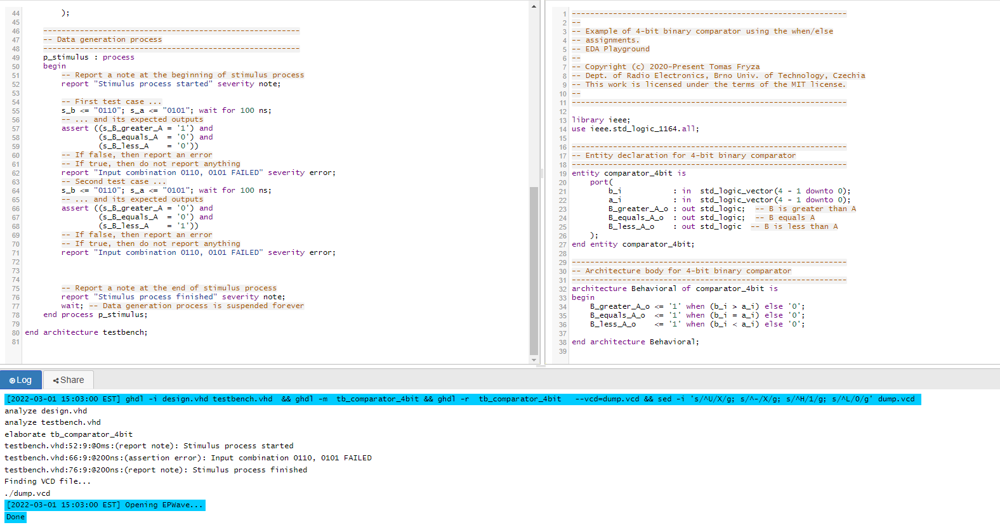
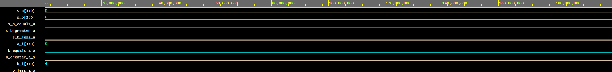

# Lab 2: ADRIÁN LABAN

### 2-bit comparator

1. Karnaugh maps for other two functions:

   Greater than:

   
| :-: | :-: | :-: | :-: | :-: | :-: |
|    |   |    | A0 | A1 |    |
|    |   | 00 | 01 | 11 | 10 |
|    | 00| 1  | 0  | 0  | 0  |
| B0 | 01| 1  | 0  | 0  | 0  |
| B1 | 11| 1  | 1  | 0  | 1  |
|    | 10| 1  | 1  | 0  | 0  |


   Less than:

| :-: | :-: | :-: | :-: | :-: | :-: |
|    |   |    | A0 | A1 |    |
|    |   | 00 | 01 | 11 | 10 |
|    | 00| 0  | 1  | 1  | 1  |
| B0 | 01| 0  | 0  | 1  | 1  |
| B1 | 11| 0  | 0  | 0  | 0  |
|    | 10| 0  | 0  | 1  | 0  |

2. Equations of simplified SoP (Sum of the Products) form of the "greater than" function and simplified PoS (Product of the Sums) form of the "less than" function.

   

### 4-bit comparator

1. Listing of VHDL stimulus process from testbench file (`testbench.vhd`) with at least one assert (use BCD codes of your student ID digits as input combinations). Always use syntax highlighting, meaningful comments, and follow VHDL guidelines:

   Last two digits of my student ID: **xxxx65**

```vhdl
    p_stimulus : process
    begin
        -- Report a note at the beginning of stimulus process
        report "Stimulus process started" severity note;

        -- First test case
        s_b <= "0110";  s_a <= "0101";  wait for 100 ns;  -- b je 6, a je 5
        -- Expected output
        assert ((s_B_greater_A  = '1') and
                (s_B_equals_A   = '0') and
                (s_B_less_A     = '0'))
        -- If false, then report an error
        report "Input combination 0101 and 0101 FAILED" severity error;

        -- Report a note at the end of stimulus process
        report "Stimulus process finished" severity note;
        wait;
    end process p_stimulus;
```

2. Text console screenshot during your simulation, including reports.

   
   

3. Link to your public EDA Playground example:

   [https://www.edaplayground.com/x/DF5X](https://www.edaplayground.com/x/DF5X)