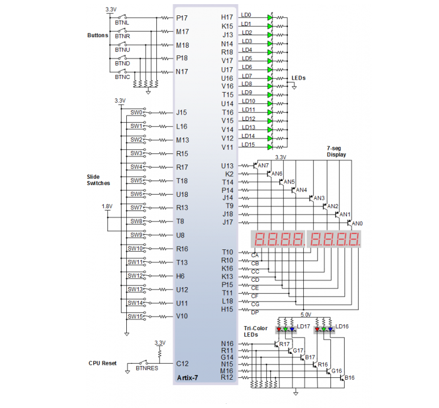

## Preparation tasks (done before the lab at home)

The Nexys A7 board provides two four-digit common anode seven-segment LED displays (configured to behave like a single eight-digit display).

1. 

**LEDs**
| **LED number** | **FPGA pin** |
| :-: | :-: |
| LD0 | H17 |
| LD1 | K15 |
| LD2 | J13 |
| LD3 | N14 |
| LD4 | R18 |
| LD5 | V17 |
| LD6 | U17 |
| LD7 | U16 |
| LD8 | V16 |
| LD9 | T15 |
| LD10 | U14 |
| LD11 | T16 |
| LD12 | V15 |
| LD13 | V14 |
| LD14 | V12 |
| LD15 | V11 |

**Switches**
| **LED number** | **FPGA pin** |
| :-: | :-: |
| SW0 | J15 |
| SW1 | L16 |
| SW2 | M13 |
| SW3 | R15 |
| SW4 | R17 |
| SW5 | T18 |
| SW6 | U18 |
| SW7 | R13 |
| SW8 | T8 |
| SW9 | U8 |
| SW10 | R16 |
| SW11 | T13 |
| SW12 | H6 |
| SW13 | U12 |
| SW14 | U11 |
| SW15 | V10 |

2. Complete the decoder truth table for **common anode** 7-segment display.

   | **Hex** | **Inputs** | **A** | **B** | **C** | **D** | **E** | **F** | **G** |
   | :-: | :-: | :-: | :-: | :-: | :-: | :-: | :-: | :-: |
   | 0 | 0000 | 0 | 0 | 0 | 0 | 0 | 0 | 1 |
   | 1 | 0001 | 1 | 0 | 0 | 1 | 1 | 1 | 1 |
   | 2 | 0010 | 0 | 0 | 1 | 0 | 0 | 1 | 0 |
   | 3 | 0011 | 0 | 0 | 0 | 0 | 1 | 1 | 0 |
   | 4 | 0100 | 1 | 0 | 0 | 1 | 1 | 0 | 0 |
   | 5 | 0101 | 0 | 1 | 0 | 0 | 1 | 0 | 0 |
   | 6 | 0110 | 0 | 1 | 0 | 0 | 0 | 0 | 0 |
   | 7 | 0111 | 0 | 0 | 0 | 1 | 1 | 1 | 1 |
   | 8 | 1000 | 0 | 0 | 0 | 0 | 0 | 0 | 0 |
   | 9 | 1001 | 0 | 0 | 0 | 0 | 1 | 0 | 0 |
   | A | 1010 | 0 | 0 | 0 | 1 | 0 | 0 | 0 |
   | b | 1011 | 1 | 1 | 0 | 0 | 0 | 0 | 0 |
   | C | 1100 | 0 | 1 | 1 | 0 | 0 | 0 | 1 |
   | d | 1101 | 1 | 0 | 0 | 0 | 0 | 1 | 0 |
   | E | 1110 | 0 | 1 | 1 | 0 | 0 | 0 | 0 |
   | F | 1111 | 0 | 1 | 1 | 1 | 0 | 0 | 0 |

  
