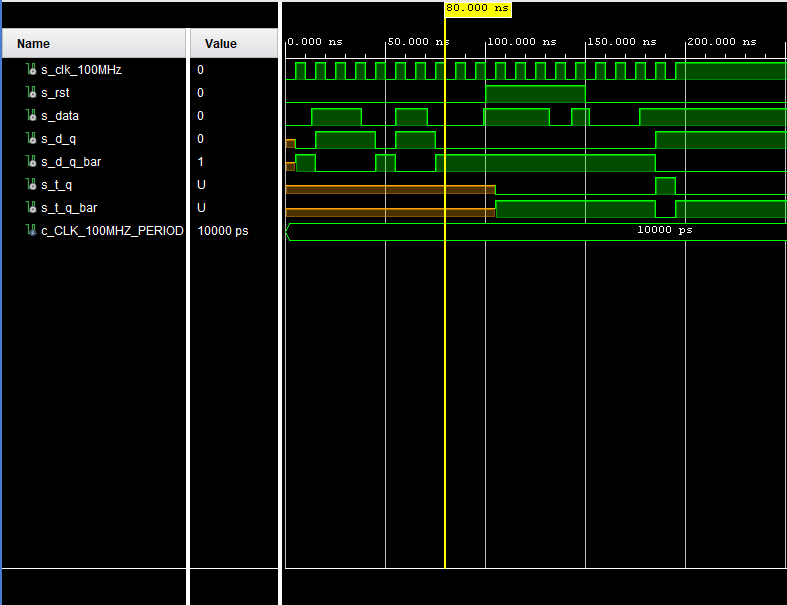

# Lab 5: Adrián Laban

### Flip-flops

1. Listing of VHDL architecture for T-type flip-flop. Always use syntax highlighting, meaningful comments, and follow VHDL guidelines:

```vhdl

library IEEE;
use IEEE.STD_LOGIC_1164.ALL;

-- Uncomment the following library declaration if using
-- arithmetic functions with Signed or Unsigned values
--use IEEE.NUMERIC_STD.ALL;

-- Uncomment the following library declaration if instantiating
-- any Xilinx leaf cells in this code.
--library UNISIM;
--use UNISIM.VComponents.all;

entity t_ff_rst is
    Port ( clk   : in STD_LOGIC;
           rst   : in STD_LOGIC;
           t     : in STD_LOGIC;
           q     : out STD_LOGIC;
           q_bar : out STD_LOGIC);
end t_ff_rst;

architecture Behavioral of t_ff_rst is
    signal s_q : std_logic;
begin
    p_t_ff_rst : process(clk)
        begin
            if rising_edge(clk) then  
                    if (rst = '1') then 
                    s_q     <= '0';            
                    else
                        if (t = '0') then
                        s_q <= s_q;                         
                        else
                        s_q <= not s_q;
                        end if;
                    end if;
            end if;
    end process p_t_ff_rst;
    
    q <= s_q;
    q_bar <= not s_q;
    
end architecture Behavioral;
```

2. Screenshot with simulated time waveforms. Try to simulate both flip-flops in a single testbench with a maximum duration of 200 ns, including reset. Always display all inputs and outputs (display the inputs at the top of the image, the outputs below them) at the appropriate time scale!

   

### Shift register

1. Image of the shift register block schematic. The image can be drawn on a computer or by hand. Always name all inputs, outputs, components and internal signals!

   